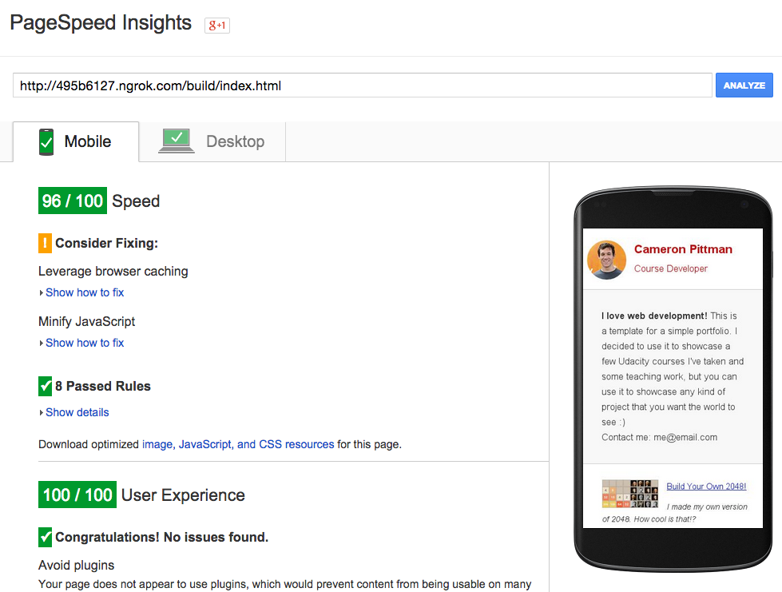

## Website Performance Optimization portfolio project

###Part 1

* Created several gulp tasks to process the original files located on `src` folder, output is located on `build` folder
* Used `async` for google analytics code
* Used `media="print"` for print styles
* Optimized fonts using @font-face
* Inlined CSS with gulp task check `main-page` task
* Optimized images with gulp task check `main-page-img` task
* Minified and verified Javascript with gulp task check `main-page-js` task
* Using `python -m SimpleHTTPServer 8080` and ngrok got up to 96/100 on PageSpeed Insights

###Part 2
* Minified and verified Javascript with gulp task check `pizza-page-js` task
* Minified CSS with gulp task check `pizza-page-css` task
* Optimized for loop on `changePizzaSizes`, also used `requestAnimationFrame`
* Optimized for loop on `updatePositions`

####Usage
The build folder has a compiled version of all the sources you can go to the build folder and server the pages from there using `python -m SimpleHTTPServer 8080`

####Resources
* [An Introduction to Gulp.js](http://www.sitepoint.com/introduction-gulp-js/)
* [Learning Gulp](https://github.com/JREAM/learning-gulp)
* [WebFonts Optimization](https://developers.google.com/web/fundamentals/performance/optimizing-content-efficiency/webfont-optimization)